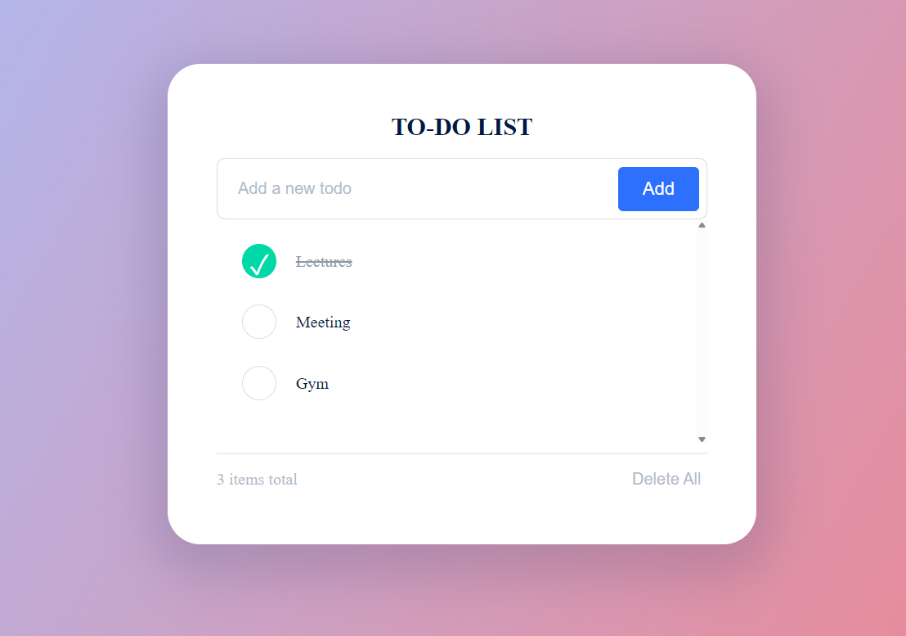

# Todo App

A simple, responsive todo application built with  HTML, CSS, and JavaScript. Manage your daily tasks with an intuitive interface and persistent local storage.

Features

- ✅ Add new tasks
- ✏️ Edit existing tasks
- ✅ Mark tasks as complete/incomplete
- 🗑️ Delete tasks
- 💾 Persistent storage (tasks saved in browser)
- 📱 Responsive design for mobile and desktop
- 🎨 Clean, modern UI
- ⌨️ Keyboard shortcuts (Enter to add, Escape to cancel)

